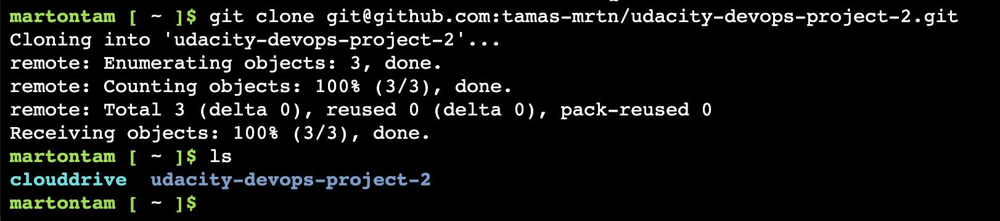
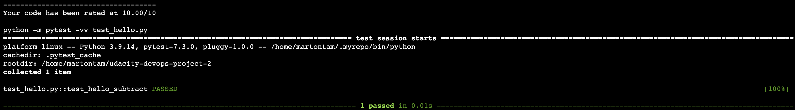
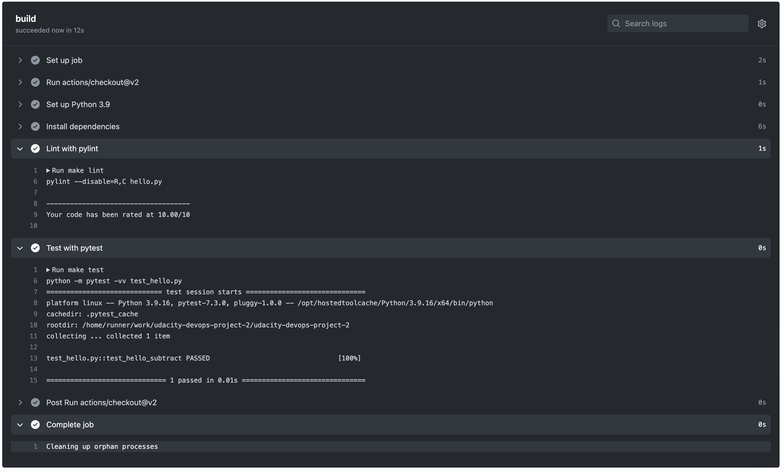
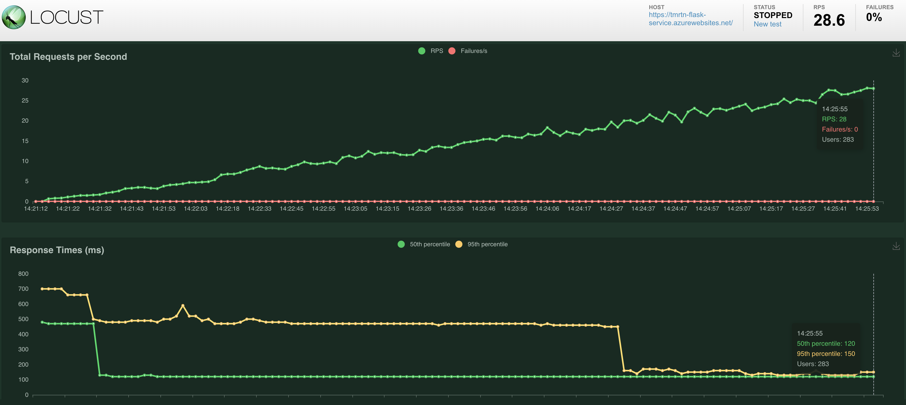
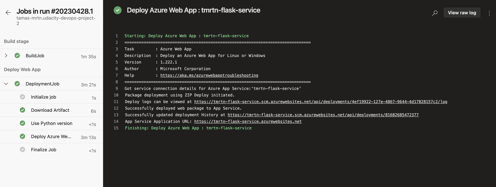
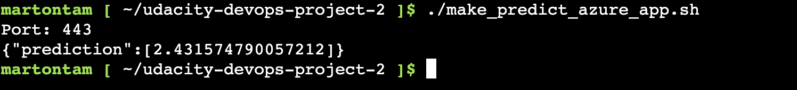
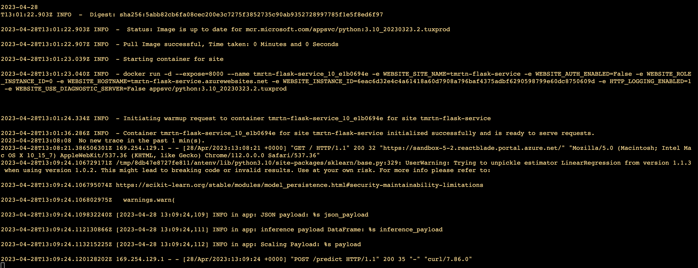
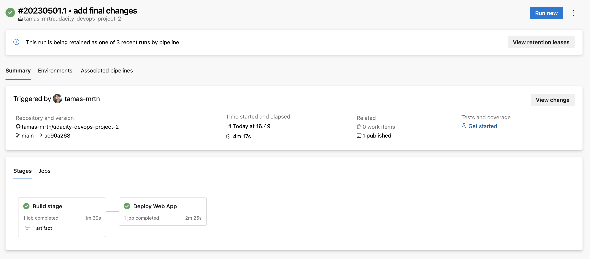

# Overview

This project showcases how to build a simple CI/CD pipeline using Github Actions and Azure DevOps. We deploy a simple flask-based API to make house price predictions. We use Makefile to setup the Continuous Integration on Github Actions. Then, we integrate the project with Azure Pipelines to enable Continuous Delivery that adds the committed changes to Azure App Services.

## Project Plan

* [Trello board of the project](https://trello.com/invite/b/GU6Nhn6s/ATTIb637823876c8106c5817a5c6cc3a735eF2E5CECA/project-management)
* Project plan: please find project-management.xlsx

## Instructions

### Prerequisities

Before embarking on this project please make sure you have the following:

* An Azure account: https://portal.azure.com/
* A Github account: https://github.com/
* An Azure DevOps account: https://dev.azure.com/)

### CI architecture

The below image showcases how the different components work together to create the continuous integration flow. In essence, whenever a git push or pull request arrives to the main branch on the git repo (ie. initiated from Azure Cloud Shell), Github Actions will run an Actions Container that executes the commands set in the Actions Config file, which in this case is to execute the steps in the Makefile.

### CD architecture

The below image shows what happens after a successful CI run on Github Actions. Github sends a message to Azure Pipelines which then will run the config that will deploy the changes to Azure App Service.

### How to start

Please follow these steps in order to setup this Python project:

* In Azure Portal, request a Cloud shell and clone this repo: 
* Run `make setup` command in Cloud shell to create virtual environment
* Run `source ~/.udacity-devops/bin/activate` to activate virtual env
* Run `make all` to install dependencies, run linter and run tests 
* Verify CI process by adding a commit and checking Github Actions UI if the process passed the tests: 
* Authorize Azure App Service and try manually deploying the app: `az webapp up -n <your-appservice>`
* Verify that your app has been deployed: `https://<your-appservice>.azurewebsites.net/`
* Run load test with locust: `locust -f locustfile.py` 
* Follow the official documentation to deploy your app in Azure Pipelines: [Documentation](https://learn.microsoft.com/en-us/azure/devops/pipelines/ecosystems/python-webapp?view=azure-devops)
* Running Azure App Service from Azure Pipelines automatic deployment, the finished pipeline should look like this: 
* Run prediction from Azure Cloud Shell against the deployed app in App Service: `./make_predict_azure_app.sh` 
* Output of streamed log files from deployed application: 
* Successful pipeline run: 

## Enhancements

To improve the project, consider the following:

* Add unit tests
* Improve load test with locust to check other functionalities

## Demo 

Link to demo: https://youtu.be/pxrF7WxwIZg

